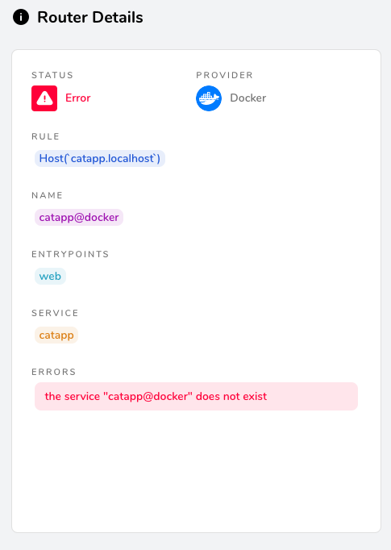
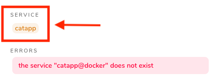
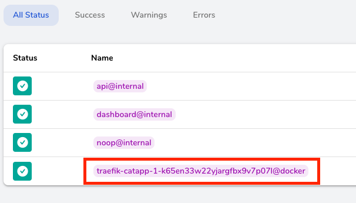

# Traefik Routers & Services Lab

 


## 1. Deploying a Traefik Router, Service, and Load balancer step-by-step
1. Before we begin, lets cleanup any running Docker stack `docker stack rm traefik` If you named you stack something else use your specified name. If you don't remember run `docker stack ls`
2. Change to the `03-Routers-and-Services` folder
3. Open the `docker-compose.yml` file in your favorite editor and review the `catapp` section
4. Start Traefik and the `catapp` but with no labels `docker stack deploy -c docker-compose.yml traefik`
5. Open the Traefik Dashboard [http://0.0.0.0:8080](http://0.0.0.0:8080) and verify Traefik is running and `catapp` does not have a router or service in Traefik.
6. From the `03-Routers-and-Services` edit the `docker-compose.yml` file and add our first label to the `catapp` as seen below. We are adding/removing the comment from the `labels:` option and uncomment the Traefik label `- "traefik.enable=true"` to enable catapp inside Traefik.

```yaml
catapp:
     image: mikesir87/cats:1.0
     labels:
       - "traefik.enable=true"
```

7. From the `03-Routers-and-Services` directory execute this command -> `docker stack deploy -c docker-compose.yml traefik` **this will update our Docker Swarm Stack with the new Label changes. Changes take about 10-15 seconds to apply**
8. Open the Traefik Dashboard [http://0.0.0.0:8080](http://0.0.0.0:8080) and review the `catapp` Router & Service. **What do you see?**
   
`catapp`is now running but with default configurations provided from Traefik. Now, we will set additional Labels to define the Router Rule, Entrypoint, and service.

1. From the `03-Routers-and-Services` directory edit the `docker-compose.yml` file and add the Labels to the `catapp` for a Router rule, define the Entrypoint, and service as seen below. Uncomment the `- "traefik.http.routers.catapp.rule=Host(`catapp.localhost`)"` to define the hostname of our `catapp` as `catapp.localhost`. Next, we define which Entrypoint to use with the **Label** uncomment `- "traefik.http.routers.catapp.entrypoints=web"` to define HTTP/web Entrypoint. Finally, we uncommet the next label `- "traefik.http.routers.catapp.service=catapp"` to tell the Router which Service to use. This is for Demo purposes only as normally Traefik pulls this configuration automatically. The new `catapp` section the `docker-compose.yml` file should look like this:

```yaml
catapp:
    image: mikesir87/cats:1.0
    labels:
      - "traefik.enable=true"
      - "traefik.http.routers.catapp.rule=Host(`catapp.localhost`)"
      - "traefik.http.routers.catapp.entrypoints=web"
      - "traefik.http.routers.catapp.service=catapp"
```

10. From the `03-Routers-and-Services` directory execute this command -> `docker stack deploy -c docker-compose.yml traefik` **this will update our Docker Swarm Stack with the new Label changes. Changes take about 10-15 seconds to apply**
11. Review the logs output `docker service logs traefik_traefik` **Note the name comes from Stack name + service name. So if you used a different Stack name you need to run `docker service logs <your-stack-name_traefik>`**
12. The last line in the log file should indicate the issue
13. Open the Traefik Dashboard [http://0.0.0.0:8080](http://0.0.0.0:8080) and review the `catapp` Router & Service. **What do you see?**

## 2. Troubleshooting Router / Service configurations
OK, so we broke our `catapp` What exactly shall we do? Let's investigate why `catapp`is not working with Traefk.

1. Open the Traefik Dashboard [http://0.0.0.0:8080](http://0.0.0.0:8080) and notice we have a Router Error.
2. Click on our **`catapp` Router** to view the error. **Do you notice the error is the same as what we saw in the logs?**

 

3. In the ****Router Details** of the `catapp` click the on the **Service** -> `catapp` **What do you see?**

 

4. When you click the `catapp` service from the Router Details screen you should have been greeted by an error `Service not found catapp@docker` 
5. In the Traefik Dashboard click the **HTTP Services** Menu
6. Look at the services, what do you notice about the `catapp` service?

 

**NOTE** Take a look at the name of the `catapp` service. You will notice the name is random generated. `traefik-catapp-random`

1. From the `03-Routers-and-Services` directory edit the `docker-compose.yml` file and add the Label to the `catapp` to define the Load Balancer port `- "traefik.http.services.catapp.loadbalancer.server.port=5000"` by removing the comment
2. From the `03-Routers-and-Services` directory execute this command -> `docker stack deploy -c docker-compose.yml traefik` **this will update our Docker Swarm Stack with the new Label changes.**
3. Open the Traefik Dashboard [http://0.0.0.0:8080](http://0.0.0.0:8080) and wait about 15-20 seconds for the changes to be visible in the dashboard. Notice that the Router error is now cleared.
4. Navigate to the **Router** menu and notice everything is now healthy
5. Navigate to the **Services** menu and notice the service is now named `catapp@docker` as intended

## 3. Make everything Dynamic
In this Lab we will comment out the **Service** and **Load Balancer** Labels to see how Traefik will *Dynamically* create the service and **Load Balancer**.

1. From the `03-Routers-and-Services` directory edit the `docker-compose.yml` file and remove/add comment to the **Labels** `- "traefik.http.routers.catapp.service=catapp"` and `- "traefik.http.services.catapp.loadbalancer.server.port=5000"` from the `catapp`. The only **Labels** enabled as seen below:

```yaml
catapp:
    image: mikesir87/cats:1.0
    labels:
      - "traefik.enable=true"
      - "traefik.http.routers.catapp.rule=Host(`catapp.localhost`)"
      - "traefik.http.routers.catapp.entrypoints=web"
```

2. From the `03-Routers-and-Services` directory execute this command -> `docker stack deploy -c docker-compose.yml traefik` **this will update our Docker Swarm Stack with the new Label changes.**
3. Open the Traefik Dashboard [http://0.0.0.0:8080](http://0.0.0.0:8080) and wait about 15-20 seconds for the changes to be visible in the dashboard. 
4. Navigate to the **HTTP Router** & **HTTP Services** menus. You should now see that Traefik Dynamically created service name which is now recognized by the **Router**
5. Stop and clean-up `docker stack rm traefik`

### Solution for the catapp Labels Lab

Please check the `03-Routers-and-Services/docker-compose.answers.yml` if you get stuck anywhere during the lab or need a reference.

```yaml
catapp:
    image: mikesir87/cats:1.0
    labels:
      - "traefik.enable=true"
      - "traefik.http.routers.catapp.rule=Host(`catapp.localhost`)"
      - "traefik.http.routers.catapp.entrypoints=web"
      - "traefik.http.routers.catapp.service=catapp"
      - "traefik.http.services.catapp.loadbalancer.server.port=5000"
```

# Continue to the Next Lab HTTPS / TLS / Let's Encrypt Lab

### Click here to continue -> [HTTPS  & TLS](https://github.com/56kcloud/traefik-training/blob/master/04-HTTPS-TLS/traefik-https-tls.md)
