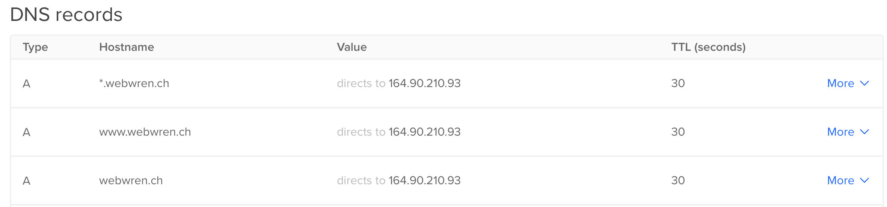

# Traefik HTTPS / TLS / Let’s Encrypt Lab

 

# Prerequisite

**In order to complete this section of the lab you will need a domain name to use for testing. Additionally, ensure your DNS provider is listed in the available DNS Provider integrations section [https://docs.traefik.io/v2.3/https/acme/#providers](https://docs.traefik.io/v2.3/https/acme/#providers)**

1. Ensure you have a domain name for testing
2. Configure the DNS of your domain name to use your Docker server where you will run the below lab. Refer to your domain providers documentation.
3. I've created the following DNS entries to perform all 3 labs

 

## 1. Deploy Traefik with Let's Encrypt HTTP Challenge
1. Before we begin, lets cleanup any running Docker stack `docker stack rm traefik` If you named you stack something else use your specified name. If you don't remember run `docker stack ls`
2. Change to the `04-HTTPS-and-TLS` folder
3. Open the `traefik.http.yml` file in your favorite editor and review the `Challenge HTTP` section
4. Edit the `traefik.http.yml` and edit your `email:` located in the `Challenge HTTP` section
5. Open the `docker-compose.http.yml` file in your favorite editor and review the `catapp` section
6. Edit the `docker-compose.http.yml` `catapp` section and add your domain here in the `- "traefik.http.routers.catapp.rule=Host(`your_domain_here`)"` label
7. Start Traefik and the `catapp` `docker stack deploy -c docker-compose.yml traefik`
8. Open the Traefik Dashboard [http://0.0.0.0:8080](http://0.0.0.0:8080) and verify Traefik is running and `catapp` has TLS enabled.
9.  Open the `catapp` using the domain you filled in at step 6. Remember to use HTTPS now https://your_domain_here.com 
10. You should now see the `catapp` served with HTTPS and a proper Let's Encrypt Certificate

## 2. Deploy Traefik with Let's Encrypt TLS Challenge
1. Before we begin, lets cleanup the HTTP stack  `docker stack rm traefik` If you named you stack something else use your specified name. If you don't remember run `docker stack ls`
2. Change to the `04-HTTPS-and-TLS` folder
3. Open the `traefik.tls.yml` file in your favorite editor and review the `Challenge TLS` section
4. Edit the `traefik.tls.yml` and edit your `email:` located in the `Challenge TLS` section
5. Open the `docker-compose.http.yml` file in your favorite editor and review the `catapp` section
6. Edit the `docker-compose.http.yml` `catapp` section and add your domain here in the `- "traefik.http.routers.catapp.rule=Host(`your_domain_here`)"` label
7. Start Traefik and the `catapp` `docker stack deploy -c docker-compose.yml traefik`
8. Open the Traefik Dashboard [http://0.0.0.0:8080](http://0.0.0.0:8080) and verify Traefik is running and `catapp` has TLS enabled.
9.  Open the `catapp` using the domain you filled in at step 6. Remember to use HTTPS now https://your_domain_here.com 
10. You should now see the `catapp` served with HTTPS and a proper Let's Encrypt Certificate

## 3. Deploy Traefik with Let's Encrypt DNS Challenge
1. Before we begin, lets cleanup the TLS stack `docker stack rm traefik` If you named you stack something else use your specified name. If you don't remember run `docker stack ls`
2. Change to the `04-HTTPS-and-TLS` folder
3. Open the `traefik.dns.yml` file in your favorite editor and review the `Challenge DNS` section
4. Edit the `traefik.dns.yml` and edit your `email:` located in the `Challenge DNS` section
5. Open the `docker-compose.dns.yml` file in your favorite editor and review the `catapp` section
6. Edit the `docker-compose.dns.yml` `catapp` section and add your domain here in the `- "traefik.http.routers.catapp.rule=Host(`your_domain_here`)"` label
7. Start Traefik and the `catapp` `docker stack deploy -c docker-compose.yml traefik`
8. Open the Traefik Dashboard [http://0.0.0.0:8080](http://0.0.0.0:8080) and verify Traefik is running and `catapp` has TLS enabled.
9.  Open the `catapp` using the domain you filled in at step 6. Remember to use HTTPS now https://your_domain_here.com 
10. You should now see the `catapp` served with HTTPS and a proper Let's Encrypt Certificate

# Continue to the Next Lab HTTPS / TLS / Let's Encrypt Lab

### Click here to continue -> [Routers & Services Lab](https://github.com/56kcloud/traefik-training/blob/master/05-middlewares/traefik-middlewares.md)
