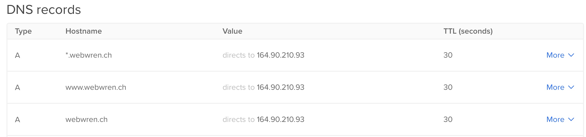
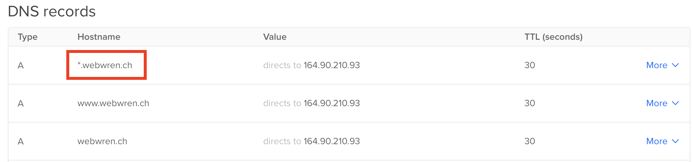

# Traefik Middlewares Lab

 

 

## 1. Add Basic Authentication to our CatApp
1. Before we begin, lets cleanup any running Docker stack `docker stack rm traefik` If you named you stack something else use your specified name. If you don't remember run `docker stack ls`
2. Change to the `05-Middlewares` folder
3. Generate a new password for our `catapp` by running `htpasswd -nb traefik training`
4. Every `$` in the password needs to have double `$$` to escape the characters correctly. 

Run the `htpasswd` command

```bash
htpasswd -nb traefik training
traefik:$apr1$.zPbdVg8$LcHeyCZElH.JfxkxxlMPI.

```

How the password looks after Escaping the `$`

```bash
traefik:$$apr1$$.zPbdVg8$$LcHeyCZElH.JfxkxxlMPI.

```

5. Open the `docker-compose.auth.yml` file in your favorite editor and review the `catapp` section
6. Edit the `docker-compose.http.yml` `catapp` section and add your domain here in the `- "traefik.http.routers.catapp.rule=Host(`your_domain_here`)"` label
7. Start Traefik and the `catapp` `docker stack deploy -c docker-compose.yml traefik`
8. Open the Traefik Dashboard [http://0.0.0.0:8080](http://0.0.0.0:8080) and verify Traefik is running and `catapp` has TLS enabled.
9.  Open the `catapp` using the domain you filled in at step 6. Remember to use HTTPS now https://your_domain_here.com 
10. You should now see the `catapp` served with HTTPS and a proper Let's Encrypt Certificate

## 2. Deploy Traefik with Let's Encrypt TLS Challenge
1. Before we begin, lets cleanup the HTTP stack  `docker stack rm traefik` If you named you stack something else use your specified name. If you don't remember run `docker stack ls`
2. Change to the `04-HTTPS-and-TLS` folder
3. Open the `traefik.tls.yml` file in your favorite editor and review the `Challenge TLS` section
4. Edit the `traefik.tls.yml` and edit your `email:` located in the `Challenge TLS` section
5. Open the `docker-compose.http.yml` file in your favorite editor and review the `catapp` section
6. Edit the `docker-compose.http.yml` `catapp` section and add your domain here in the `- "traefik.http.routers.catapp.rule=Host(`your_domain_here`)"` label
7. Start Traefik and the `catapp` `docker stack deploy -c docker-compose.yml traefik`
8. Open the Traefik Dashboard `http://your_domain_here:8080` and verify Traefik is running and `catapp` has TLS enabled.
9.  Open the `catapp` using the domain you filled in at step 6. Remember to use HTTPS now https://your_domain_here.com 
10. You should now see the `catapp` served with HTTPS and a proper Let's Encrypt Certificate

## 3. Deploy Traefik with Let's Encrypt DNS Challenge
1. Before we begin, lets cleanup the TLS stack `docker stack rm traefik` If you named you stack something else use your specified name. If you don't remember run `docker stack ls`
2. Change to the `04-HTTPS-and-TLS` folder
3. Log in to your DNS provider and collect the Authorization Tokens for your provider. Review the [https://docs.traefik.io/v2.3/https/acme/#providers](https://docs.traefik.io/v2.3/https/acme/#providers) list to see which tokens you require for your provider. This step is unique to the DNS provider you are using. 
4. Copy the Authorization Tokens from your provider
5. Open the `docker-compose.dns.yml` file in your favorite editor and review the `traefik` section
6. Edit the `Environment` section under the `Traefik` service.
7. Paste the Authorization Tokens from your provider in this section. You may need different and/or additional fields here based on your provider.

```yml
    environment:
      - "DO_AUTH_TOKEN=<Your Super Secret Digital Ocean Token Goes here>"
```

8. In the same `docker-compose.dns.yml` edit the `catapp` section and add your domain here in the `- "traefik.http.routers.catapp.rule=Host(`your_domain_here`)"` label
9.  Open the `traefik.dns.yml` file in your favorite editor and review the `Challenge DNS` section
10. Edit the `traefik.dns.yml` and edit your `email:` located in the `Challenge DNS` section
11. Start Traefik and the `catapp` `docker stack deploy -c docker-compose.yml traefik`
12. Open the Traefik Dashboard `http://your_domain_here:8080` and verify Traefik is running and `catapp` has TLS enabled.
13. Open the `catapp` using the domain you filled in at step 6. Remember to use HTTPS now https://your_domain_here.com 
14. You should now see the `catapp` served with HTTPS and a proper Let's Encrypt Certificate

## 3.1 Use Wildcard Let's Encrypt Certificate

 

1. Add a new DNS record to your DNS provider. Add `*.` in front of your domain `*.you_domain.com` which enables all sub-domain certificates
2. Now that the Wildcard is configured for DNS, we can edit the Edit the `docker-compose.dns.yml` `catapp` section and add your domain here in the `- "traefik.http.routers.catapp.rule=Host(`your_domain_here`)"` label. This time we will update the domain to `training.your_domain_here.com` 
3. Open up `https://training.your_domain_here`

# Continue to the Next Lab Middlewares

### Click here to continue -> [Middlewares Lab](https://github.com/56kcloud/traefik-training/blob/master/05-middlewares/traefik-middlewares.md)
