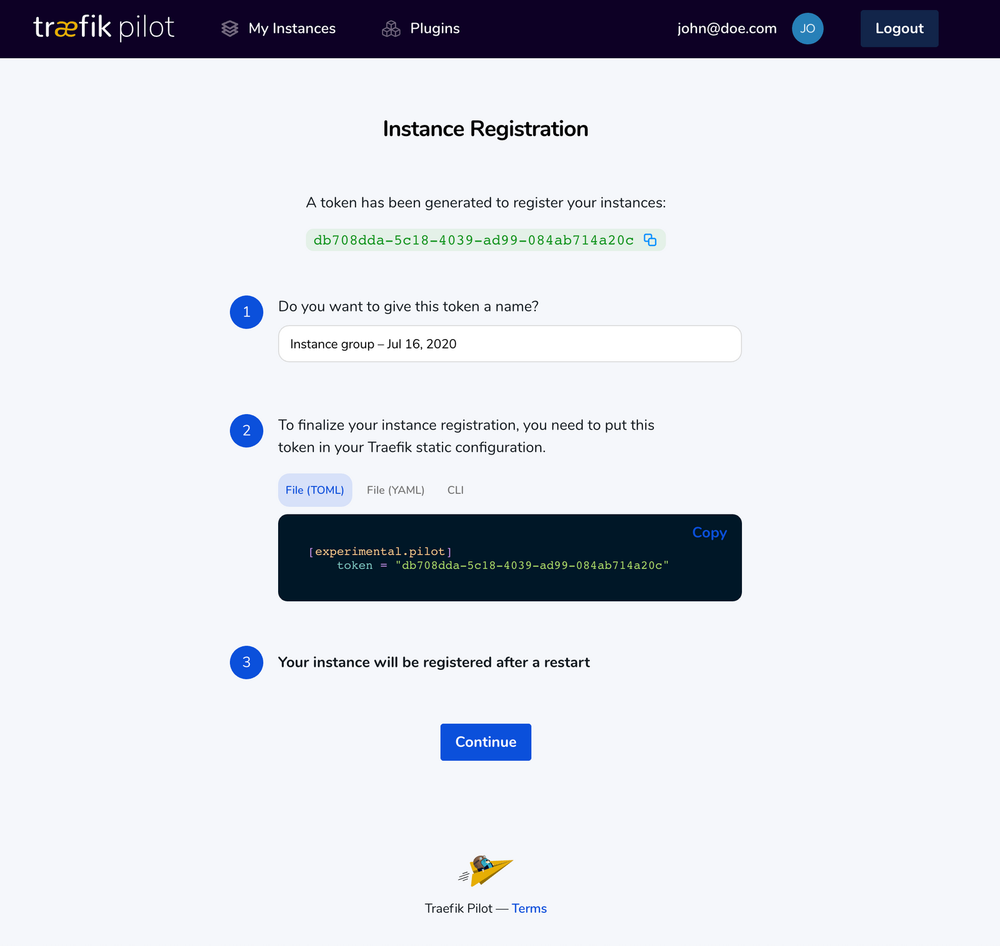

# Traefik Advanced Tips

 

## 1. Enable Traefik Pilot
1. Before we begin, lets cleanup any running Docker stack `docker stack rm traefik` If you named you stack something else use your specified name. If you don't remember run `docker stack ls`
2. Change to the `08-Advanced-Tips` folder
3. Start Traefik `docker stack deploy -c docker-compose.pilot.yml traefik`
4. Open the Traefik dashboard [0.0.0.0:8080](http://0.0.0.0:8080)
5. At the top of the Dashboard click `Register Traefik Instance`
6. Fill in step 1 token name
7. Step 2 copy the static configuration in file(YAML) format and pasted in the `traefik.yml` file in the `Enable Traefik Pilot` section

```yml
################################################################
# Enable Traefik Pilot
################################################################
experimental:
  pilot:
    token: "<insert your token here>"
```  

  

8.  Stop Traefik `docker stack rm traerfik`
9.  Redeploy Traefik `docker stack deploy -c docker-compose.pilot.yml traefik`
10. Open the Traefik dashboard [0.0.0.0:8080](http://0.0.0.0:8080)
11. Open Traefik Pilot by clicking on your username in the upper right hand corner. 


# Continue to the Next to Advance Tips

### Click here to continue -> [Advanced Tips](https://github.com/56kcloud/traefik-training/blob/master/08-Advanced-Tips/traefik-advanced-tips.md)
